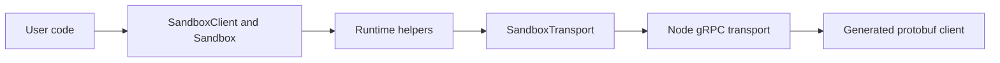

<!--
SPDX-FileCopyrightText: 2026 CoreWeave, Inc.
SPDX-License-Identifier: Apache-2.0
SPDX-PackageName: cwsandbox
-->

# Source Layout

The package keeps public entrypoints small and stable while implementation
details live in explicit internal layers.

```text
src/
  index.ts       Public root entrypoint.
  client.ts      Transport-neutral SandboxClient.
  sandbox.ts     Public Sandbox handle.
  defaults.ts    Public defaults.
  errors.ts      Public error hierarchy.
  transport.ts   Injectable transport interface.
  types.ts       Temporary internal type barrel.

  node/          Public @coreweave/cwsandbox/node shim.
  wandb/         Public @coreweave/cwsandbox/wandb shim.

  public/        Exported SDK type contracts.
  runtime/       Implementation behind the Sandbox handle.
  internal/      Private helpers and validators.
  transport/     Transport DTOs.
  transports/    Concrete transport implementations.
  integrations/  Optional auth/ecosystem integrations.
  streaming/     Shared async stream primitives.
  test/          Shared test helpers.
```

## Data Flow



## Public Subpaths

Public package names stay simple:

- `@coreweave/cwsandbox`
- `@coreweave/cwsandbox/node`
- `@coreweave/cwsandbox/wandb`

The public `/node` subpath is a Node runtime entrypoint. Its implementation is
the Node gRPC transport in `transports/node-grpc/`. The public `/wandb` subpath
is a W&B auth wrapper. Its implementation lives under `integrations/wandb/`.

## Boundaries

- `public/` owns SDK-visible TypeScript types. Do not import generated protobuf
  types into this layer.
- `runtime/` owns command, file, log, shell, wait, and snapshot helpers used
  by `Sandbox`. Snapshot is two algorithms (capture READY/FAILED poll vs list
  pagination), one record (`FileSystemSnapshotResult` on the transport seam).
- `internal/` owns private normalizers, validation, and helper logic. Do not
  export from this folder.
- `transport.ts` and `transport/` define the SDK backend contract.
- `transports/node-grpc/` implements that contract for Node gRPC and owns
  generated protobuf code.
- `node/` and `wandb/` are public subpath shims.
- `test/` contains shared test helpers only.

## TypeScript Rules

- Prefer `interface` for public SDK object shapes.
- Public methods and functions should have explicit return types.
- Use `import type` for type-only imports.
- Use relative imports with `.js` extensions; do not add `tsconfig` path aliases.
- Avoid new internal barrel files. `src/types.ts` is temporary and should be
  removed in a follow-up cleanup.
- Avoid explicit `undefined` properties under `exactOptionalPropertyTypes`; use
  conditional object spreads instead.

Dependency direction:

- `public/` should not import implementation modules.
- `internal/` should not import `runtime/` or concrete transports.
- `runtime/` may import `public/`, `internal/`, and transport contracts.
- `transports/node-grpc/` may import `public/`, `transport/`, and `internal/`,
  but should not import `runtime/`.
- Public subpath shims may import implementation modules only to expose public
  factories or re-exports.

## Naming

- `client.create()` creates a default keep-alive sandbox.
- `client.run(command)` creates a sandbox with a custom main process.
- `client.withSandbox(...)` scopes work to a sandbox with cleanup.
- `client.get(id)` fetches metadata only.
- `client.fromId(id)` reconnects to a live `Sandbox` handle.
- `sandbox.inspect()` refreshes metadata on an existing handle.
- `sandbox.commands.run(...)` runs a buffered command.
- `sandbox.commands.start(...)` starts a streaming command.
- `sandbox.exec(...)` is an alias for buffered command execution.
- `sandbox.shell(...)` starts an interactive TTY session.
